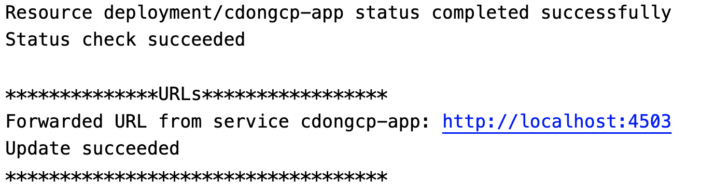
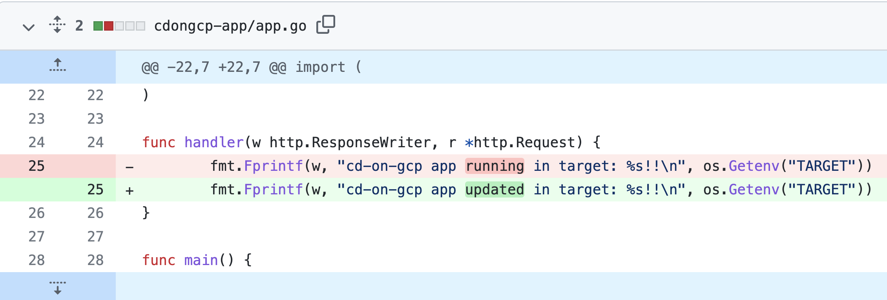
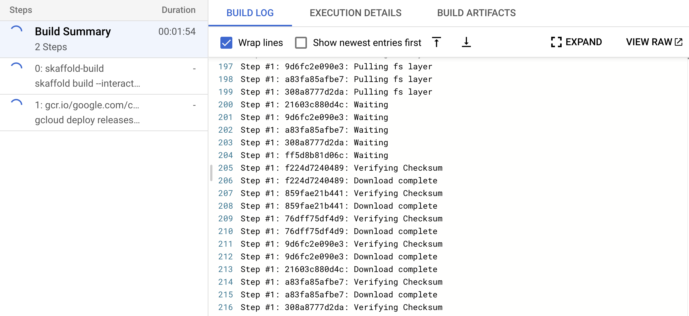
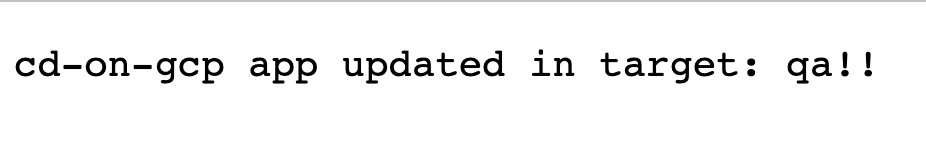

# Continuous Delivery on GCP Tutorial

This repo contains some example assets to evaluate how to use Google [Cloud Code](https://cloud.google.com/code/docs/shell), [Cloud Build](https://cloud.google.com/build/docs/overview), [Google Cloud Deploy](https://cloud.google.com/deploy/docs/overview) and [Skaffold](https://skaffold.dev/) to automate software delivery and promote releases through multiple stages on GCP.

Using these assets and following the instructions below you could experiment an example flow where:
1. A developer forks the application repo in his Github account
2. The developer makes a change to the code using [Cloud Shell Editor and Cloud Code](https://cloud.google.com/code/docs/shell), the change is immediately deployed in his dev cluster running in minikube in the Cloud Shell
3. When he is happy with the change he opens a pull request to the main repo
4. QA team makes a specific comment to the PR and this automatically executes a Cloud Build trigger that builds a container with Skaffold, creates a relese on Cloud Deploy and rolls it out in a QA GKE cluster where usability tests can be run
5. After the QA team is happy, the PR is merged and this runs another trigger that promotes the release to a Prod GKE Cluster. The Cloud Deploy prod target requires approval so an approval request is triggered, the App Release team checks the rollout and approves it so the app is released in production

## What you need
* A GCP project with GKE, Cloud Build, Cloud Deploy, Artifact Registry APIs enabled
* A main Google user account with project owner role on the project that will be used as someone from Platform Team / QA / App Release team 
* A Github account
* An additional Google user account that will be used as the 'developer', this account should also have a separate Github account to fork the repo in

## Preparation

1. Create 2 GKE Clusters: one for the QA environment and the other for the prod environment, both in the same location (zone or region).
2. Create an [Artifact Registry](https://cloud.google.com/artifact-registry) Repository to store your images
3. Fork this repo to your Github account and clone locally, this will be used as the application repo for the tutorial
4. Run [setup.sh](setup.sh) from the local repo clone and follow prompt to insert your GCP project, cluster names and location, Artifact Registry repository, Cloud Deploy delivery pipeline region. Then commit and push to your fork.
5. Create a Cloud Deploy [delivery pipeline](https://cloud.google.com/deploy/docs/deploying-application#creating_your_delivery_pipeline) using [the manifest provided](clouddeploy-config/delivery-pipeline.yaml). It will create a pipeline that has qa and prod as stages each using a profile with the same name.
6. Create 2 Cloud Deploy targets mapping the above clusters to the pipeline stages using [this manifest for qa cluster](clouddeploy-config/target-qa.yaml) and [this one for prod cluster](clouddeploy-config/target-prod.yaml).
7. [Create 2 Cloud Build triggers](https://cloud.google.com/build/docs/automating-builds/create-manage-triggers) linked to your fork of the Github repo:
    1. The 1st trigger must be invoked by a pull request with Comment control enabled and use the [build-qa.yaml](build-qa.yaml) build config
    2. The 2nd trigger must be invoked by a push to the main branch and  should use the [release-prod.yaml](release-prod.yaml) build config
8. Create 1 additional Chrome profile (or use Chrome Incognito window), this will be used for the developer tasks, from this Chrome profile or window:
    1. Log in to the additional Github account
    2. Create another fork of the repo (this will be the developer fork in the flow) from the one forked by the main account
    3. Log in to Google Cloud Shell
    4. Configure personal access token for Github account
    5. Clone the fork of the repo locally
    6. Move in the local repo folder and launch Cloud Shell Editor with the repo folder added to his workspace with the command `cloudshell workspace .`


## Execution


1. From the developer Cloud shell editor launch minikube (in the lower blue Cloud Code bar click **minikube** and choose minikube in the upper window that should be the only option, and then **Start**)
2. If asked, click **AUTHORIZE** on the Authorize Cloud Shell prompt
3. Click on the Cloud Code status bar (in the lower left corner) and then select **Run on Kubernetes**
4. When asked for the Skaffold profile choose **[default]**
5. In the Output pane you see that the build start for the leeroy-app application image
6. When deployment is complete Skaffold/Cloud Code will print the exposed url where the services have been forwarded, click the link and then **Open web preview**





7. You see the app frontpage displaying this message:


8. Now, let’s try to update the application to see the change implemented immediately in the deployment on the cluster, open the **app.go** file in **leeroy-app folder** in **Cloud Shell Editor**
9. Change the message in row 25 to “`leeroooooy app updated in target: …`”, you should see the build and deployment process starting immediately
10. At the end of the deploy click again on the forwarded url or refresh the browser window with the application to see your change deployed
11. After the developer is happy with the change he wants to commit so, execute:

    ```
    git add leeroy-app/app.go
    git commit -m "new feature"
    git push
    ```


12. Go on the developer github page containing the repository and create a pull request 
13. You will see that some check fails because the Cloud Build Trigger require a comment from the central repo owner (QA team)
14. From the main browser window (the one with your main account logged), go to the repository on Github, click on the **new-feature** PR, examine code changes, you ar acting as the QA team at the moment





15. In the conversation, write `/gcbrun` in a new comment, this will make the Cloud Build Trigger configured in [build-qa.yaml](build-qa.yaml) run, you will see checks running on Github. As you can see from the build config file, this build will:
    1. Build a container image with your updated code using `skaffold build`
    2. Store the image in your Artifact Registry repository
    3. Create a Cloud Deploy Release (this will automatically roll out the release in the 1st stage of the pipeline that is the QA Cluster)
16. Go to Cloud Build History, you will see a build running, click on it, you will see the logs 





17. After the build completes you should be able to see your container image uploaded to your Artifact Registry repository, the image tag will be the repository commit id
18. From the GCP Console, go to Cloud Deploy, you should see your rollout completed (or in progress) to the QA stage of the pipeline


19. With kubectl, using the context of the QA GKE cluster, view the Pods and services created, as in the following command
20. 


```
➜  ~ kubectl --context=qa-cluster get pod,svc
NAME                              READY   STATUS    RESTARTS   AGE
pod/leeroy-app-5c9c5dd4c7-fmnvp   1/1     Running   0          42m

NAME                 TYPE           CLUSTER-IP   EXTERNAL-IP      PORT(S)        AGE
service/kubernetes   ClusterIP      10.4.0.1     <none>           443/TCP        30d
service/leeroy-app   LoadBalancer   10.4.15.58   35.240.121.132   80:30981/TCP   42m

```


21. Get the external ip address for the **leeroy-app** Service get to the address with your broswer, you should see the app deployed in QA





22. Let’s pretend that the QA team performs some usability test now, when they are happy, go back to the Github page from your main account and merge the PR
23. This will trigger the execution of the trigger linked to the [release-prod.yaml](release-prod.yaml) build, if you go back to Cloud Build history you should see a new build running
24. After the build completes you will see an approval request in the Cloud Deploy pipeline
25. Click on Review and then approve the request
26. With kubectl, using the context of the Prod GKE cluster, view the Pods and services created
27. Get the external ip address for the **leeroy-app** Service get to the address with your broswer, you should see the app deployed in QA